# Flash Camera 3D Wire Dilatometer

_Python acquisition and analysis app for synchronized UV/blue Flash imaging, with v0.2.0 adding a two-camera 3D wire dilatometer workflow._

---

## Overview

This repo contains the Flash camera application used to acquire synchronized imagery from Basler, Allied Vision, UVC, Optris, and simulated camera sources. The current build extends the original dual-camera UV imaging app into a 3D wire dilatometer for Flash experiments.

The v0.2.0 dilatometer path is designed around:

- Existing IMX487-class UV cameras: Basler `a2A2840-48umUV` and an Allied Vision Alvium U-812 UV or equivalent
- Two orthogonal views: front `x-z` and top `x-y`
- 0.16X SilverTL-class telecentric full-sample imaging
- 470 nm strobed backlit silhouette segmentation
- OpenCV/Numpy wire edge tracking and 3D tube reconstruction
- Balluffi-style excess-expansion and apparent defect swelling calculations
- OES/electrical synchronization metadata through the existing IPC path

For the full engineering build plan, see [`DILATOMETER_BUILD_PLAN.md`](./DILATOMETER_BUILD_PLAN.md). A shareable PDF copy is included as [`DILATOMETER_BUILD_PLAN.pdf`](./DILATOMETER_BUILD_PLAN.pdf), and a vendor-ready optics/illumination request is in [`DILATOMETER_VENDOR_QUOTE_REQUEST.md`](./DILATOMETER_VENDOR_QUOTE_REQUEST.md).

## System workflow

```mermaid
flowchart LR
    accTitle: Dilatometer Data Flow
    accDescr: Synchronized cameras acquire front and top silhouettes, the app stores raw frames and metadata, and export tools reconstruct a 3D wire tube with Balluffi-style apparent defect swelling.

    setup["Configure cameras, optics, and 470 nm lighting"] --> acquire["Record synchronized front/top frames"]
    acquire --> metadata["Save raw TIFFs and session metadata"]
    metadata --> wire["Run wire-metrics export"]
    wire --> tube["3D tube model: length, bowing, diameter"]
    tube --> balluffi["Balluffi calculation"]
    balluffi --> report["CSV/JSON-ready result for analysis"]
```



## Repository layout

| Path | Purpose |
|---|---|
| [`flash_camera/main.py`](./flash_camera/main.py) | GUI entry point |
| [`flash_camera/core/`](./flash_camera/core/) | Camera interfaces, camera manager, recorder, IPC, dilatometer config |
| [`flash_camera/gui/`](./flash_camera/gui/) | PyQt camera views, controls, overlays, recording UI |
| [`flash_camera/analysis/`](./flash_camera/analysis/) | Wire silhouette reconstruction, Balluffi calculations, DIC backend registry |
| [`flash_camera/utils/export_session.py`](./flash_camera/utils/export_session.py) | Session export, montage, intensity stats, wire metrics, Balluffi CLI |
| [`flash_camera/config/default_config.yaml`](./flash_camera/config/default_config.yaml) | Camera, recording, IPC, and dilatometer defaults |
| [`flash_camera/config/camera_presets.yaml`](./flash_camera/config/camera_presets.yaml) | Alignment, UV, 470 nm dilatometer, and focus-sweep presets |
| [`flash_camera/tests/`](./flash_camera/tests/) | Unit tests for camera, recorder, and dilatometer analysis paths |

## Installation

Use Python 3.10 or newer.

```bash
python3 -m venv .venv
source .venv/bin/activate
python3 -m pip install -e ".[dev]"
```

For hardware cameras, install the vendor SDKs and optional camera bindings:

```bash
python3 -m pip install -e ".[cameras]"
```

The Basler path requires Pylon/pypylon. The Allied Vision path requires Vimba X/VmbPy. Without hardware SDKs, use simulated mode for development.

## Running the app

Run with physical cameras:

```bash
flash-camera
```

Run without hardware:

```bash
flash-camera --simulated
```

Run with verbose camera discovery logs:

```bash
flash-camera --verbose
```

Use a custom config:

```bash
flash-camera --config path/to/config.yaml
```

## Dilatometer hardware baseline

The configured v0.2.0 default assumes:

| Component | Baseline |
|---|---|
| Front camera | Basler `a2A2840-48umUV`, optical axis along `y`, measuring `x-z` |
| Top camera | Allied Vision Alvium U-812 UV equivalent, optical axis along `z`, measuring `x-y` |
| Lens pair | 0.16X SilverTL-class telecentric or true 2/3 inch equivalent |
| Working distance | 177 mm reference plane |
| Field of view | About 48.6 mm across the gauge |
| Pixel scale | About 17.1 um/px on IMX487-class cameras |
| Illumination | 470 nm strobed backlight, one per view |
| Filters | 470 nm bandpass, OD4 minimum out-of-band blocking |
| Primary output | 3D centerline arc length, bowing, diameter/width, apparent swelling |

The depth-of-field plan uses the straight room-temperature wire as the object plane. The conservative high-accuracy bowing envelope is about +/-10 mm in the defocus direction for each camera; frames approaching +/-20 mm should be quality-flagged.

## Session metadata

Saved sessions include:

- Camera inventory, model, SDK, lens, filter, FOV, and working distance
- Recording quality, timestamps, raw TIFF paths, and preview MP4 paths
- OES sync payload when the OES app triggers acquisition
- Dilatometer metadata: camera pair, coordinate system, optics, illumination, calibration, QC, and Balluffi defaults

The relevant metadata helper is [`flash_camera/core/dilatometer_config.py`](./flash_camera/core/dilatometer_config.py).

## Export and analysis commands

Show session metadata:

```bash
export-session info /path/to/session
```

Create a two-camera montage:

```bash
export-session montage /path/to/session --frame 0 --output montage.tiff
```

Compute intensity statistics:

```bash
export-session stats /path/to/session basler
```

Compute 3D wire metrics from the configured front/top camera pair:

```bash
export-session wire-metrics /path/to/session --frame 0 --output wire_metrics.json
```

Compute Balluffi-style apparent defect swelling from macro strain:

```bash
export-session balluffi --macro-strain 0.0423 --cte-strain 0.009
```

Compute Balluffi-style apparent defect swelling from measured 3D lengths:

```bash
export-session balluffi --initial-length-mm 48.0 --current-length-mm 50.016 --cte-strain 0.009
```

Check optional DIC/metrology backend availability:

```bash
export-session dic-backends
```

## Analysis modules

[`flash_camera/analysis/wire_silhouette.py`](./flash_camera/analysis/wire_silhouette.py) implements the v1 wire pipeline:

1. Segment the dark wire against a bright 470 nm backlight
2. Extract per-column silhouette edges
3. Compute 2D centerlines and apparent widths for each view
4. Fuse orthogonal front/top centerlines into a 3D tube model
5. Report arc length, end-to-end length, bowing, diameter, and QC fields

[`flash_camera/analysis/balluffi.py`](./flash_camera/analysis/balluffi.py) implements:

- Constant-CTE thermal strain
- Trapezoidal `alpha(T) dT` integration
- Excess strain: `epsilon_excess = epsilon_macro - epsilon_lattice`
- Apparent defect fraction: `c_app = 3 * epsilon_excess`
- Length-derived macro strain: `(L_3D(t) - L_0) / L_0`
- Warnings above the dilute-regime threshold

[`flash_camera/analysis/dic_backends.py`](./flash_camera/analysis/dic_backends.py) treats OpenCV wire silhouette reconstruction as the primary backend. DICe, OpenCorr, and MultiDIC remain validation paths for foils, coupons, or textured reference data.

## Validation checklist

Before claiming physical defect density, run:

- Gauge pin or known-diameter wire scale validation
- Focus/defocus sweep at 0, +/-5, +/-10, and +/-20 mm
- Non-flash translated wire test for centerline and arc-length repeatability
- Platinum or other known thermal expansion run for CTE visibility
- OES/electrical timestamp alignment check
- Lattice-parameter or temperature model review before treating `c_app` as more than apparent swelling

## Tests

Run the full test suite:

```bash
python3 -m pytest
```

The current suite covers camera interfaces, recording, wire silhouette reconstruction, stereo tube metrics, backend status, and Balluffi calculations.

## Version history

| Version | Summary |
|---|---|
| `v0.1.0` | Original dual-camera UV imaging app |
| `v0.2.0` | Adds 3D wire dilatometer analysis, metadata, export tools, docs, and vendor request brief |

